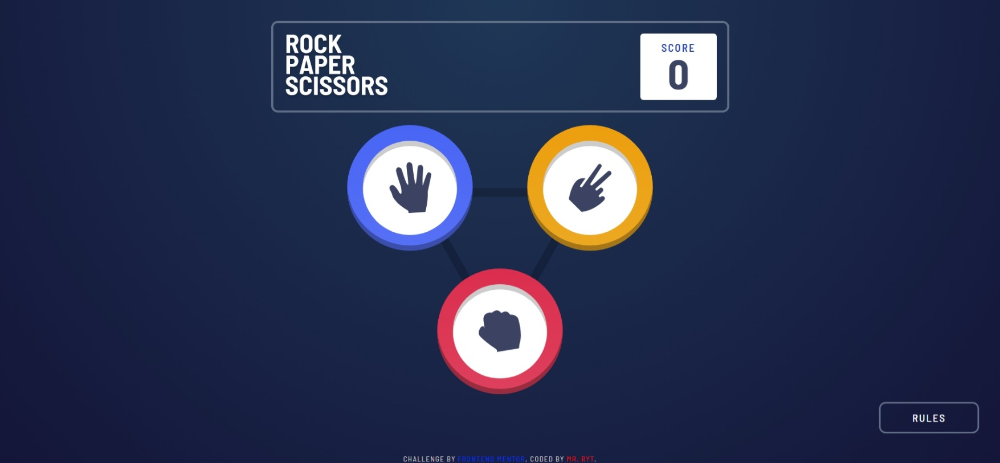
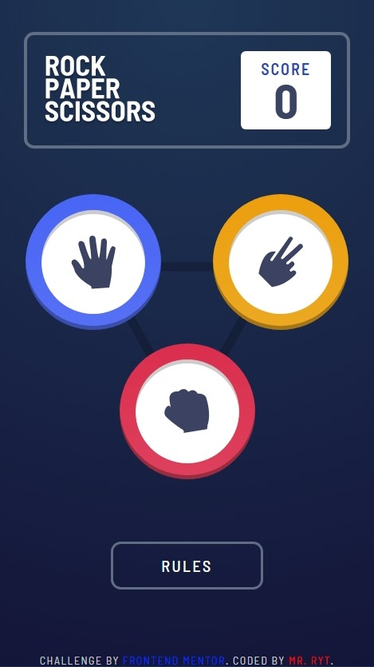

# Frontend Mentor - Rock, Paper, Scissors solution

This is a solution to the [Rock, Paper, Scissors challenge on Frontend Mentor](https://www.frontendmentor.io/challenges/rock-paper-scissors-game-pTgwgvgH). Frontend Mentor challenges help you improve your coding skills by building realistic projects.

## Table of contents

- [Overview](#overview)
  - [The challenge](#the-challenge)
  - [Screenshot](#screenshot)
  - [Links](#links)
- [My process](#my-process)
  - [Built with](#built-with)
  - [What I learned](#what-i-learned)
  - [Continued development](#continued-development)
  - [Useful resources](#useful-resources)
- [Author](#author)

## Overview

### The challenge

Users should be able to:

- View the optimal layout for the game depending on their device's screen size
- Play Rock, Paper, Scissors against the computer
- Maintain the state of the score after refreshing the browser _(optional)_
- **Bonus**: Play Rock, Paper, Scissors, Lizard, Spock against the computer _(optional)_

### Screenshot




### Links

- Solution URL: [https://github.com/MrRyt247/rock-paper-scissors-game](https://github.com/MrRyt247/rock-paper-scissors-game)
- Live Site URL: [https://mrryt247.github.io/rock-paper-scissors-game/](https://mrryt247.github.io/rock-paper-scissors-game/)

## My process

### Built with

- [Angular](https://angular.dev/) - JS Framework
- TypeScript
- Flexbox
- CSS Grid
- CSS custom properties

### What I learned

I challenged myself to apply my basic knowledge in Angular. And to also learn along the build process. Here is what I learnt in the process:

- Component Styling

```css
:host {
  display: flex;
  flex-direction: column;
  ...
}
```

- Component Communication with Signals

```ts
// Service - score.service.ts
private scoreSignal = signal<number>(0);
readonly score = this.scoreSignal.asReadonly();
...

// Components
// game.component.ts
...
scoreService = inject(ScoreService);
this.scoreService.incrementScore();
...

// scoreboard.component.ts
@Component({
  template: `<span>{{ scoreService.score() }}</span>`
})
export class ScoreboardComponent {
  scoreService = inject(ScoreService);
}
```

- Modals with Angular

```html
<div class="modal-backdrop" *ngIf="isVisible" [class.show]="isOpen" (click)="onBackdropClick()">
  <div class="modal" [class.show]="isOpen" (click)="onModalClick($event)">
    <h2 class="header">Rules</h2>

    <div class="body">
      
    </div>

    <button class="close" type="button" (click)="closeModal()">
      
    </button>
  </div>
</div>

```

### Continued development

- Signals
- Dependency Injection
- Routes

### Useful resources

- [Angular Docs](https://angular.dev/overview) - Through this, I was able to implement communication between components.

## Author

- Frontend Mentor - [@MrRyt247](https://www.frontendmentor.io/profile/MrRyt247)
- GitHub - [MrRyt247](https://github.com/MrRyt247/MrRyt247)
